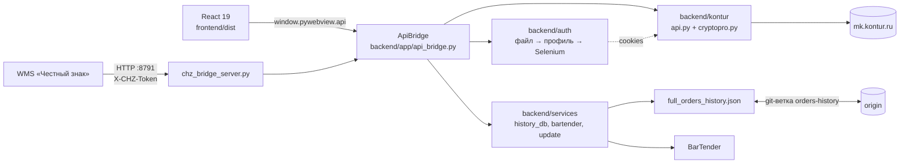

# Архитектура

Один процесс Python (`main.py` → `backend/app/desktop.py`) открывает окно
pywebview с React-интерфейсом из `frontend/dist`. Все действия UI идут через
`ApiBridge` (`backend/app/api_bridge.py`) — его методы являются контрактом
между фронтом и бэком.

## Потоки данных

**Заказ кодов.** Экран Orders → `ApiBridge` → `backend/kontur/api.py`
(REST к mk.kontur.ru; подпись документов — `cryptopro.py`, CAdES) → запись в
`backend/services/history_db.py` → `full_orders_history.json`. «Настоящие»
статусы дотягивает отдельный процесс `backend/app/true_status_worker.py`,
который ApiBridge запускает сабпроцессом.

**Cookies (авторизация).** `backend/auth/service.py`, по убыванию дешевизны:
(1) файл `runtime/auth/kontur_cookies.json`; (2) cookies из профиля Яндекс
Браузера (`yandex_cookies.py`); (3) Selenium + YandexDriver (`browser.py`).
Каждый источник подтверждается живым `GET /api/v1/user` — TTL файла сам по
себе ничего не доказывает. Selenium открывает реальный профиль с окном за
экраном (`--window-position=-32000,-32000`) плюс Win32 `SW_HIDE`; параллельный
«сторож» прячет окна новых процессов `browser.exe`, а после неудачной попытки
осиротевшие процессы принудительно завершаются. Фоновая пролонгация доступа —
раз в ~9 ч (`prolongation.py`).

**Обновления.** UI раз в 5 минут зовёт `check_for_updates` (git fetch +
сравнение HEAD с `origin/main`); кнопка «Обновить» → `apply_update` →
`git merge --ff-only origin/main`, перезапуск вручную. `frontend/dist`
закоммичен сознательно: UI приезжает тем же pull, Node.js на рабочих ПК не
нужен. Жёсткий путь — `Обновление.bat` → `scripts/update_windows.ps1`
(stash → pull/reset → пересборка окружения).

**История между ПК.** `history_db.py` синхронизирует
`full_orders_history.json` через служебную git-ветку `orders-history`
(pull примерно раз в 20 с при обращениях, push с ретраями; кэш —
`runtime/state/history_sync_cache`). Управляется `HISTORY_SYNC_ENABLED` /
`HISTORY_SYNC_BRANCH`.

**WMS («Честный знак»).** `backend/app/chz_bridge_server.py` слушает
`0.0.0.0:8791` (env `CHZ_BRIDGE_ENABLED/HOST/PORT/TOKEN`).
`POST /api/chz/requests` (обязательный заголовок `X-CHZ-Token`) →
`ApiBridge.receive_wms_chz_request` → заявка попадает в очередь заказов;
`GET /api/chz/health` — доступность и число активных заявок. Без окна мост
поднимает `backend/app/server_only.py` (ярлык «CRPT server» в автозагрузке).
Отдельного экрана CHZ в UI нет.

## Известные ограничения

- Профиль Яндекс Браузера блокируется запущенным браузером: при
  «profile is in use» приложение завершает процессы `browser.exe` и повторяет
  попытку — открытый у пользователя браузер при этом закроется.
- `api_bridge.py` — монолит ~6.9 тыс. строк. Методы — контракт для UI;
  распиливать только с сохранением сигнатур.
- Selenium кликает по абсолютным XPath живой вёрстки Контура
  (`browser.py`) — редизайн mk.kontur.ru их ломает.
- `HEADLESS = False` принципиально: через `--headless=new` авторизация
  не проходит.
- Порт 8791 слушает `0.0.0.0`; POST защищён только токеном —
  `CHZ_BRIDGE_TOKEN` обязателен.
- Копия из exe-установщика не содержит `.git`: внутриприложенческие
  обновления и синхронизация истории там не работают.
